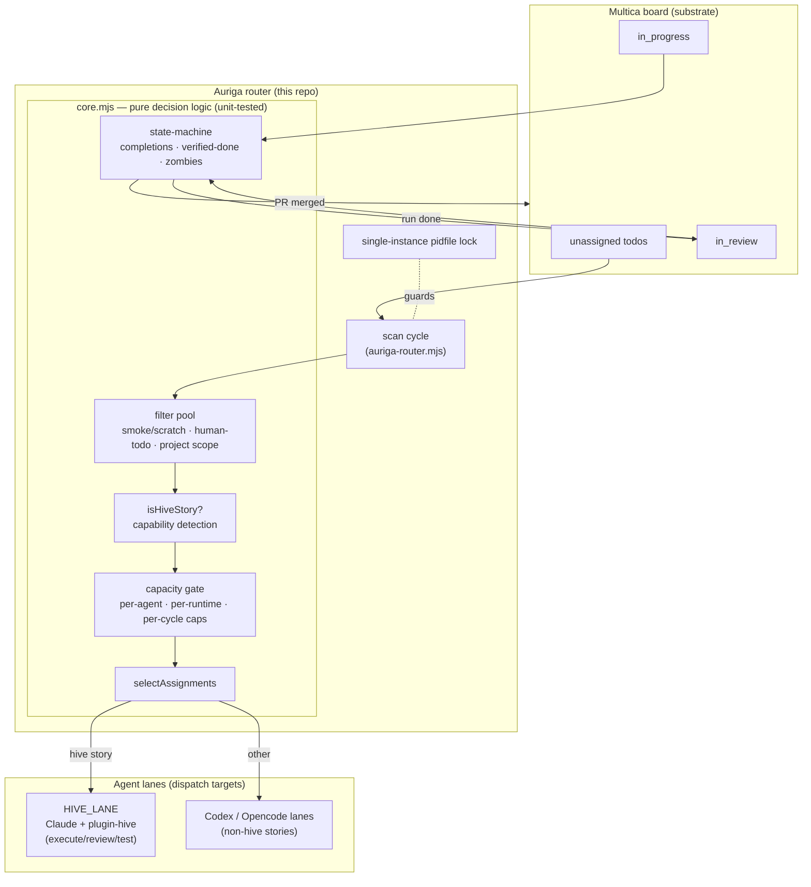

```bash
curl -fsSL https://mdostal.github.io/auriga/install.sh | bash
```

# Auriga

**The router god of [Pantheon](https://github.com/mdostal/pantheon-v2).** Auriga senses board
state and dispatches each unit of work to the right lane and agent — the PM/router of the
Pantheon SDLC pipeline.

## What & why

A swarm of agents building software needs a single thing deciding *who* does *what* and *when* —
otherwise tickets pile up unassigned, hive-authored stories get routed to runtimes that can't run
them, and a single overloaded runtime collapses throughput to zero. Auriga is that decision layer.

It runs as a standalone service (its own repo, its own process) so the routing policy — lane maps,
capability rules, capacity caps, human-vs-agent filtering — can evolve, be tested, and be swapped
independently of the agents it dispatches to. Auriga only ever **assigns** and **re-runs** work and
advances issue status from verifiable board facts; it never deletes or cancels. The routing decisions
themselves are pure, deterministic, and unit-tested against mocked board state.

## Architecture



**Internally**, each cycle the router: scans the configured Multica projects → recovers zombies
(stale/failed in-progress issues) → advances issue status from board facts alone (a done run →
`in_review`; a *merged* PR → `done`) → selects a small batch of unassigned todos → routes each by
capability and project lane, respecting caps → assigns and verifies a run actually started
(re-running to force-enqueue if not) → logs → sleeps. A pidfile keeps exactly one router alive.

**In Pantheon**, Auriga sits between the board and the agents. Work is planned upstream (Minerva),
lands on the Multica board, and Auriga drains it to the swarm.

## How it fits

Auriga is one plugin god bound into the [pantheon-v2](https://github.com/mdostal/pantheon-v2) host —
every god owns its own repo. It routes work across the
[Multica](https://github.com/firefly-events/multica) board (the ticket/state substrate) and dispatches
hive-authored stories to lanes running [plugin-hive](https://firefly-events.github.io/plugin-hive/)
(the `/hive:execute · review · test` SDLC workflow) — Codex/Opencode lanes have no plugin-hive install,
so capability-aware routing keeps those stories on Claude+hive lanes.

Sibling gods it works alongside: **Minerva** (planning — produces the stories Auriga routes),
**Heimdall** (lane gateway / token routing), **Hellsing** (zombie/worker reaping), **Consus**
(ideation → sign-off), and **Argus** (observability).

## Quickstart

The live router lives in [`src/router/`](src/router/) (Node 24+, no dependencies):

```sh
cd src/router

npm test           # run the pure-logic unit suite (node --test)

npm run dry        # one cycle, compute + log decisions, assign NOTHING (--once --dry-run)
npm run once       # one real cycle then exit (--once)

# supervised: keep exactly ONE detached router alive, restart on death
nohup ./supervisor.sh >> /tmp/auriga-supervisor.log 2>&1 &
```

Flags on `auriga-router.mjs`: `--once`, `--dry-run`, `--max-assign N`, `--no-zombie`.
Env overrides: `AURIGA_PER_CYCLE_TOTAL`, `AURIGA_PER_CYCLE_PER_AGENT`, `AURIGA_CYCLE_MS`,
`AURIGA_PIDFILE`, `AURIGA_LOG`. Lane maps, agent IDs, and caps live in
[`src/router/lib/config.mjs`](src/router/lib/config.mjs). See
[`src/router/README.md`](src/router/README.md) for state-machine and human-queue details.

`cycle()` no longer talks to Multica directly — it goes through the `backlogAdapter` /
`spawnAdapter` boundary in [`src/router/lib/adapters/`](src/router/lib/adapters/), which holds
the typed contracts, the real Multica-backed implementations (a behavior-preserving port of the
former `lib/multica.mjs`), an in-memory stub used by tests, and the intentionally-unbuilt
`pantheon-v2-l2` stub (the only sanctioned path from Auriga to Pantheon). See that directory's
`README.md` for the two-adapter model.

Alongside the router, [`src/server/`](src/server/) is a small read-only `node:http` JSON API
over this repo's own `.pHive/` state (epics, stories, activity — see `src/server/lib/read.mjs`),
and [`src/ui/`](src/ui/) is the Vite + Tailwind + shadcn/ui operator dashboard it serves —
together, a local, read-only web view onto the same planning/audit data the router itself acts
on. Neither package is a dependency of the router; each has its own `package.json` and `npm test`.

## Status

**WIP — live on the hive.** The `src/router/` auto-router runs live, draining the aligned Multica
projects with 26 passing unit tests; capability-aware routing and pure-code state-machine transitions
are merged on `main`. The richer TypeScript routing **engine** (board-state consumer, adapters,
escalation, verifier pool) lives on the `feat/routing-engine` branch and is not yet integrated with
the running router. See [VISION.md](VISION.md) for the trajectory and where to jump in.

> Note: `mdostal/pantheon-orchestrator` is **LEGACY** — Auriga code that used to live there has been
> moved into this repo.
