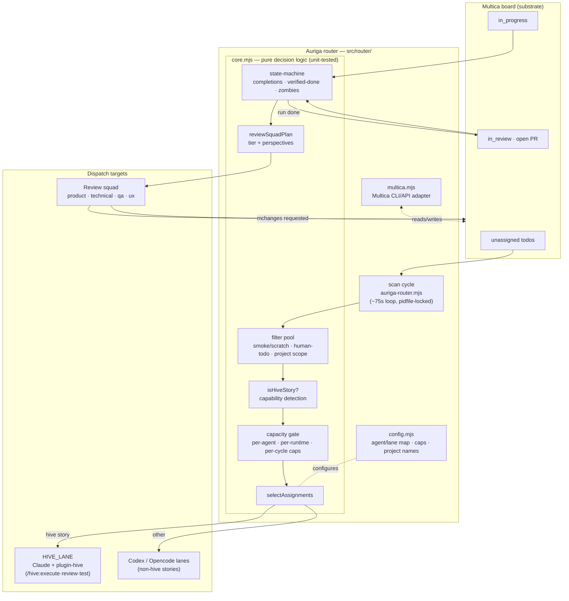

# Architecture

Auriga is a single-purpose service: **scan board state, decide who does what, dispatch.** This
doc expands on the [README](../README.md) overview with the full request/decision flow and where
each piece of the repo fits.

## Component & flow diagram

## Decision pipeline (per cycle)

1. **Scan** — `auriga-router.mjs` pulls live state for every project in `config.PROJECT_NAMES`
   via `lib/multica.mjs`.
2. **Zombie recovery** — stale/failed `in_progress` issues are detected and re-run (or
   re-assigned), respecting the same capability rule as fresh dispatch.
3. **State-machine advance** — `in_progress → in_review` when the latest run finished cleanly;
   `in_review → done` **only** when a linked PR has actually merged. Both scans re-derive
   candidates from live board facts each cycle, so they are idempotent by construction.
4. **Review squad dispatch** — an `in_review` issue with an open PR gets a sized review plan
   (`reviewSquadPlan`, see [docs/review-squad.md](review-squad.md)) instead of being treated as
   done on run-status alone.
5. **Filter + route** — remaining unassigned todos are filtered (smoke/scratch, `human-todo`,
   project scope), classified (`isHiveStory`), capacity-gated (`RUNTIME_CAP`, per-agent
   `maxInflight`, per-cycle batch caps), and assigned to a lane.
6. **Assign + verify** — the router assigns/re-runs and verifies a run actually started, then
   logs and sleeps.

All decision logic in `core.mjs` is pure — it takes plain issue/run/PR shapes in and returns
decisions out, with no network calls, which is what makes it unit-testable against mocked board
state (`src/router/test/core.test.mjs`, `squad.test.mjs`, `cascade.test.mjs`).

## Repo layout

| Path | What it is |
|---|---|
| `src/router/auriga-router.mjs` | The live entrypoint — the scan/dispatch loop described above. |
| `src/router/lib/core.mjs` | Pure decision logic: filtering, capability detection, capacity gating, state-machine transitions, review-squad sizing. |
| `src/router/lib/config.mjs` | Agent/lane map, per-runtime caps, Multica project → lane names. |
| `src/router/lib/multica.mjs` | Multica CLI/API adapter — the only place that talks to the board. |
| `src/router/supervisor.sh` | Keeps exactly one router process alive, restarts on death. |
| `src/router/test/` | Unit + loop-level e2e suite (`node --test`). |
| `scripts/` | Operational scripts — human-queue export, bulk reassign/reroute helpers. |
| `src/engine/` | Recovered TypeScript routing engine (adapters, escalation, verifier pool) from the legacy `pantheon-orchestrator` — a design source, **not yet integrated** with the live router. See `src/engine/PROVENANCE.md`. |
| `src/api/`, `src/domain/`, `src/repository/` | Read-only content API surface for downstream tools (see [INTEGRATION.md](INTEGRATION.md)). |
| `docs/` | This doc, [VISION.md](VISION.md) (trajectory), [review-squad.md](review-squad.md) (review-squad design), [INTEGRATION.md](INTEGRATION.md) (content API). |

## Where this sits in Pantheon

Auriga is one plugin god bound into the [pantheon-v2](https://github.com/mdostal/pantheon-v2)
host. It routes work across the [Multica](https://github.com/firefly-events/multica) board and
dispatches hive-authored stories to lanes running
[plugin-hive](https://firefly-events.github.io/plugin-hive/). Sibling gods: **Minerva** (planning
— produces the stories Auriga routes), **Heimdall** (lane gateway / token routing), **Hellsing**
(zombie/worker reaping), **Consus** (ideation → sign-off), and **Argus** (observability).

## Toggle / A-B / metrics

Pantheon's platform-wide model is **swappable at every layer, measured at every step** — pick your
lanes/runtimes, flip rules on and off, compare throughput and cost. Auriga is where that surfaces
most directly:

- **Toggle** — lane maps and capability rules in `config.mjs` are the switchable unit today (hand
  edited); [VISION.md §②](VISION.md#-goals--near-term-next-steps) tracks making that discovery
  dynamic instead of hand-maintained.
- **A/B** — not yet wired for routing policy itself; see the "metrics at every decision" goal
  below. The review-squad tiering (`reviewSquadPlan`) is the one place a policy is already
  explicit and inspectable (`config.REVIEW_SQUAD_RULES`) rather than implicit.
- **Metrics** — today: 26+ passing unit tests over the pure decision core is the correctness
  signal; live JSONL cycle logs are the operational signal. Planned: a structured per-assignment
  decision record (lane, runtime, rationale) so routing policy can be compared like any other
  Pantheon layer — see [VISION.md §②](VISION.md#-goals--near-term-next-steps).
